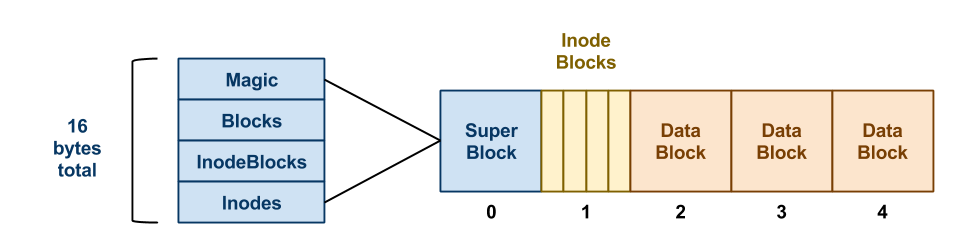

# Simple File System Implementation
Create a virtual disk based file system where we use inodes to store files and perform disk and file operations.

#### Disk: 
It is basically a file that represents the disk on a UNIX system
The first block is the super block that contains metadata about the disk, the size of the disk, the no. of inodes, the no. of data blocks and how many are free and how many are allocated.
The disk operations that are supported are:
1. Disk creation : Creating a virtual disk using a file.
2. Mounting a disk : Loads the disk metadata in memory and allows file operations to be performed on the disk.
3. Unmounting a disk: Unloads the disk and persists all the data that has been written or removed from the disk during the mount session.
4. Formatting a disk: Clears the disk, ie. removes all the written data from data blocks and inode blocks and deallocates all the allocated pointers.

#### Super Block : 
When the disk is mounted it is loaded into memory, its size is fixed.
* magic:The first field contains a magic no. that describes whether the disk is valid.
* Metadata of the disk: Disk name ,creation time,modified time,etc.
* inodes: no. of inodes
* data blocks: no. of data blocks
* boolean array of free and allocated inodes
* boolean array of free and allocated data blocks

#### Inode Block: 
Contains file information and how the file is stored on the disk using direct,indirect pointers.
1. filename,ctime,mtime,filetype,size
2. contains direct pointers.
3. A pointer to an indirect block - if null then no indirect pointers used.

#### Data block: 
Each data block is of size 4KB. It can either be a indirect block,containing indirect pointers. or a data block containing data of a file.

#### File operations :
1. Create a file : allocate new inode ,give it a name and write the inode to disk,mark it as not free
2. Open a file : loads the inode of the file in memory into a file object, and creates  a file descriptor to point to it. The file object contains information of direct and indirect pointers.
3. Read a file : Traverses all the direct and indirect pointers and prints all the data of the file on the screen.
4. Write a file : Writes to the direct and indirect pointers of the file.(supports only 1 level of indirect pointers)
5. Overrite: clears all the pointers and writes from the start , all direct pointers are filled first and then , the indirect pointers is used to create a indirect node and start writing on them as well.
6. Append: finds the last written byte, and continues writing from there.
7. Close file: closes the file descriptor of the file and saves the object information to disk.
8. delete file : removes the inode entry and deallocates the index of the boolean array.
9. list files: shows the list of files/inodes present on the disk.
10. list open files: lists the open file descriptors

### Sample images of operations :

#### Limitations:
1. Single indirect pointers: multi-level indirect pointers can be implemented by recursively creating indirect pointers by dividing the file size each time.
2. Support for file directories: directories have not been implemented.
3. File names have to be unique.
4. Supports only text files currently.
